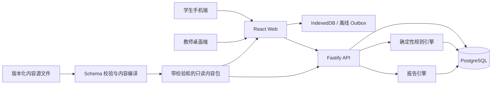

# 《老街品牌局》详细开发计划

> 对应产品文档：`PRD-老街品牌局.md`  
> 文档状态：可执行基线 v1.0  
> 编制日期：2026-08-21  
> 目标：把 PRD 拆成可依次开发、测试、验收和发布的任务；本文件不扩大 PRD 范围。

---

## 1. 开发结论

本项目采用“**确定性剧情经营游戏 + 版本化内容包 + 追加式决策日志 + 服务端重放校验**”的实现方式。

关键开发顺序是：

1. 先冻结规则、数据和内容协议；
2. 再完成第 1、5、8、11 轮纵向切片；
3. 纵向切片必须同时贯通学生端、规则引擎、离线续玩、视觉测试、延迟后果、教师追踪和因果报告；
4. 切片通过后，才扩充为 12 轮完整内容；
5. 完整内容冻结后进行 80 人并发、真机、隐私和课堂试用；
6. 生产班级一旦发布，内容版本、种子和计算规则永久只读，只能新建后续版本，不能原位修改。

> 直接建设约定：项目负责人已决定本版本不组织真人试玩。M3、M5、M8 中依赖真人试玩的体验性结论改记为“未经组织试玩验证”，不得用自动化、代理策略或开发者走查冒充真人结论；工程可靠性、内容一致性、目标设备和部署恢复门仍按原顺序执行。

以下事项不进入首版：实时多人、学生社交、开放式视觉编辑器、运行时 AI 审美评分、教师修改游戏内容、公开实名排行榜、多课程通用平台。

---

## 2. 技术基线

### 2.1 固定技术选择

| 层级          | 选择                          | 执行要求                                                     |
| ------------- | ----------------------------- | ------------------------------------------------------------ |
| 运行时        | Node.js 24 LTS                | 在 `.nvmrc`、`package.json#engines` 和 CI 中固定具体补丁版本 |
| 包管理        | pnpm workspace                | 必须提交锁文件；CI 使用 frozen lockfile                      |
| 语言          | TypeScript strict             | Web、API、规则引擎、内容编译器共用类型                       |
| Web           | React 19 + Vite 8             | 单一 Web 应用，学生端与教师端按路由懒加载                    |
| API           | Fastify                       | JSON API；教师与学生接口分命名空间                           |
| 数据库        | PostgreSQL 18                 | 使用迁移文件管理，不允许生产环境自动改表                     |
| ORM/迁移      | Drizzle ORM + Drizzle Kit     | Schema、迁移、测试种子分离                                   |
| 数据校验      | Zod                           | API、内容文件、环境变量和导出协议都校验                      |
| 单元/集成测试 | Vitest                        | 规则引擎优先使用纯函数测试和性质测试                         |
| 端到端测试    | Playwright                    | 至少覆盖 Chromium、WebKit 和手机尺寸                         |
| 离线存储      | IndexedDB + 本地 outbox       | 弱网下保留未同步决策；恢复网络后幂等同步                     |
| 样式          | CSS Modules + design tokens   | 不引入重型 UI 框架；保证手机性能与视觉可控性                 |
| 部署          | Docker 容器 + 托管 PostgreSQL | 部署商在上线前确定；代码保持供应商中立                       |

依赖版本不在本文写死为永远有效的数字。执行 `DEV-001` 时锁定当日最新稳定补丁版，此后同一发布周期只做经过测试的升级。

### 2.2 不采用的方案

- 不让前端直接结算：学生不能通过修改浏览器状态伪造结果。
- 不把每个结果写成手工分支页面：规则和报告会迅速失控。
- 不用 `Math.random()` 决定结果：所有事件必须由内容版本、班级种子、游戏局和事件键确定性派生。
- 不使用覆盖式“当前状态”代替历史：首局全过程必须可重放、可审计。
- 不依赖运行时大模型生成剧情、评分或报告：成本、稳定性、可复现性和课程公信力不满足要求。
- 不把教师后台做成 CMS：生产内容只读，内容制作在版本发布前由仓库完成。

---

## 3. 总体架构



### 3.1 三个真相来源

| 真相               | 唯一来源                            | 说明                                    |
| ------------------ | ----------------------------------- | --------------------------------------- |
| 游戏规则与课程内容 | 已发布的内容包 `content_version`    | 带版本号和 SHA-256 校验和，发布后不可改 |
| 学生做过什么       | 追加式 `decision_log` / `event_log` | 不覆盖、不删除首局记录                  |
| 学生当前状态       | 服务端按日志重放后的快照            | 快照是缓存；日志和引擎才是可验证来源    |

### 3.2 确定性规则

规则引擎必须是纯 TypeScript 包，禁止直接访问数据库、网络、系统时间或浏览器对象。给定以下输入，输出必须完全相同：

```text
contentVersion
engineVersion
classSeed
playthroughId
roundId
priorState
viewedEvidence
selectedChoice
intentPrediction
riskPrediction
visualSelections
```

伪随机事件使用派生键，例如：

```text
HMAC-SHA256(classSeed, playthroughId + eventKey + occurrenceIndex)
```

班级共享市场事件只使用 `classSeed + publicEventKey`；个人条件事件同时加入 `playthroughId` 和前置决策条件。种子只由服务端生成，教师和学生均不可设置或读取原值。

为了允许整局离线继续，开始游戏时服务端下发：已校验内容包、该班公共事件日程，以及由班级种子单向派生的 `playthroughEventSeed`。它不暴露原始班级种子。客户端可以据此离线预结算；联网后服务端仍按原始日志重放，客户端修改脚本、状态或派生种子都不能改变正式结果。

---

## 4. 仓库目标结构

```text
/
├─ AGENTS.md
├─ ARCHITECTURE.md
├─ GAME_MODEL.md
├─ CONTENT_CONTRACT.md
├─ DATA_MODEL.md
├─ PRIVACY.md
├─ package.json
├─ pnpm-workspace.yaml
├─ apps/
│  ├─ web/
│  │  └─ src/
│  │     ├─ student/
│  │     ├─ teacher/
│  │     ├─ routes/
│  │     └─ offline/
│  └─ api/
│     └─ src/
│        ├─ student-api/
│        ├─ teacher-api/
│        ├─ auth/
│        └─ persistence/
├─ packages/
│  ├─ game-engine/
│  ├─ report-engine/
│  ├─ content-schema/
│  ├─ content-runtime/
│  ├─ shared-contracts/
│  ├─ analytics-events/
│  └─ ui/
├─ content/
│  ├─ source/
│  │  ├─ story/
│  │  ├─ rounds/
│  │  ├─ events/
│  │  ├─ theory/
│  │  ├─ endings/
│  │  └─ visual-systems/
│  ├─ assets/
│  └─ compiled/
├─ db/
│  ├─ schema/
│  ├─ migrations/
│  └─ seeds/
├─ tests/
│  ├─ contracts/
│  ├─ integration/
│  ├─ e2e/
│  ├─ fixtures/
│  └─ load/
├─ scripts/
└─ docs/
   ├─ adr/
   ├─ content-authoring/
   └─ release/
```

---

## 5. 不可违反的工程约束

这些约束先写入 `ARCHITECTURE.md` 和 `AGENTS.md`，每个开发任务都必须引用。

1. 一个生产班级只能绑定一个已发布内容版本和一个不可变班级种子。
2. 内容发布后不可原位修改；修正内容必须创建新版本和新班级。
3. 每名学生在每个班级恰好有一个 `first_run`，任何重玩都标记为 `replay`。
4. 首局决策、查看证据、预测、视觉选择、触发事件、快照、报告和反思不得被覆盖。
5. 服务端不信任客户端提交的指标、结局和报告；客户端只提交动作，服务端重算结果。
6. 每个写请求必须带幂等键；重复同步不得产生重复决策或二次扣款。
7. 教师权限只读游戏规则和学生结果；后台和 API 都不得存在生产内容编辑接口。
8. 教师可以查看实名数据；投影和课堂展示默认匿名。
9. 所有报告因果结论必须能回指到具体决策、状态变化、事件和理论条目。
10. 即时结果和延迟结果分开记录，延迟事件必须能指出来源决策。
11. 隐藏指标不在游戏过程中直接暴露数值，只能通过叙事反馈和最终报告解释。
12. 视觉方案不是装饰皮肤，必须拥有可计算属性、测试表现、触点成本和延迟影响。
13. 内容文件必须通过 Schema、引用完整性、可达性和敏感词/史实审校后才能编译。
14. 所有时间以服务端 UTC 保存，界面按 Asia/Shanghai 显示。
15. 姓名、学号不得写入分析日志、错误日志、公开 URL 或前端监控标签。

---

## 6. 里程碑与发布门

| 里程碑            | 目标                                                  | 退出条件                                         |
| ----------------- | ----------------------------------------------------- | ------------------------------------------------ |
| M0 工程与协议基线 | 项目可启动、可测试、约束已冻结                        | CI 全绿；五份核心协议文档通过评审                |
| M1 规则引擎       | 用结构化内容跑通确定性结算和报告证据链                | 同输入重复运行 1,000 次哈希一致；规则单测通过    |
| M2 数据/API       | 可创建班级、加入、开始、提交动作、续玩和重放          | 重复请求不重复结算；篡改客户端结果被拒绝         |
| M3 纵向切片       | 第 1、5、8、11 轮在手机端完整可玩                     | 包含视觉测试、延迟事件、离线恢复、报告和教师追踪 |
| M4 内容冻结候选   | 12 轮、事件、3 套正式视觉系统、结局和理论映射全部完成 | 内容编译零错误；模拟测试满足平衡阈值             |
| M5 学生端 MVP     | 35–50 分钟完整首局、报告、反思、重玩                  | 关键手机浏览器 E2E 通过；首局不可覆盖            |
| M6 教师端 MVP     | 进度、路径、聚合、案例和 CSV 可用                     | 80 人数据可读；生产后台无内容修改能力            |
| M7 发布候选       | 安全、性能、隐私、备份和运维达标                      | 80 人负载、恢复演练、真机矩阵全部通过            |
| M8 课程发布       | 真实试玩后版本锁定并创建正式班级                      | 试点问题关闭；内容版本和班级种子已封存           |

任何里程碑未满足退出条件，不进入下一里程碑的范围扩张。

---

## 7. 详细任务清单

### M0：工程与协议基线

#### DEV-001 初始化仓库与工具链

- 依赖：无。
- 修改范围：仓库根目录、`apps/`、`packages/`、`.github/`。
- 工作：初始化 Git；建立 pnpm workspace；固定 Node 24 LTS 补丁版本；创建 Web、API、共享包最小入口；提交锁文件。
- 验收：`pnpm install --frozen-lockfile`、`pnpm build`、`pnpm dev` 可执行；空应用和 `/health` 正常；工作区无重复 TypeScript 配置。
- 交付：脚手架、README、环境变量示例、首次 ADR。

#### DEV-002 建立质量门与统一命令

- 依赖：DEV-001。
- 工作：配置 ESLint、Prettier、TypeScript strict、Vitest、Playwright、提交前检查和 CI。
- 验收：错误类型、未使用变量、失败测试均能阻断 CI；CI 不使用浮动依赖安装。
- 必备命令：

```text
pnpm dev
pnpm build
pnpm lint
pnpm format:check
pnpm typecheck
pnpm test
pnpm test:unit
pnpm test:integration
pnpm test:e2e
pnpm test:mobile
pnpm test:load
pnpm content:validate
pnpm content:compile
pnpm game:simulate
pnpm db:migrate
pnpm db:seed:test
```

#### ARC-001 冻结五份核心协议

- 依赖：DEV-001。
- 工作：从 PRD 提炼 `ARCHITECTURE.md`、`GAME_MODEL.md`、`CONTENT_CONTRACT.md`、`DATA_MODEL.md`、`PRIVACY.md`。
- 必须明确：指标边界、12 轮标识、首局/重玩、种子派生、教师权限、版本生命周期、因果解释结构、数据保留状态。
- 验收：PRD 的功能、事件、数据对象和验收标准都有对应条目；不存在“之后再决定”才能编码的核心歧义。

#### ARC-002 ADR 基线

- 依赖：ARC-001。
- 工作：记录“单 Web 应用”“纯规则引擎”“追加式日志”“内容编译”“不使用运行时 AI”“教师无 CMS”六项决策。
- 验收：每项包含背景、选择、替代方案、后果和撤销成本。

#### OPS-001 环境与秘密管理

- 依赖：DEV-001。
- 工作：开发、测试、预发布、生产四类配置；秘密只从环境读取；提供本地数据库启动方式。
- 验收：仓库扫描无真实秘密；缺失关键配置时应用拒绝启动并给出明确错误。

**M0 验收门：** 新成员只按 README 即可启动；CI 全绿；核心协议由产品/课程负责人确认。

---

### M1：确定性规则引擎与内容协议

#### GAME-001 定义游戏状态

- 依赖：ARC-001。
- 工作：定义可见指标、隐藏指标、预算、章节、轮次、证据查看、视觉状态、事件队列、成就标签和决策历史。
- 验收：状态可 JSON 序列化；禁止 `any`；每个字段有单位、范围、初始值和公开级别。

#### CONTENT-001 定义内容 Schema

- 依赖：GAME-001。
- 工作：为角色、章节、轮次、证据、选择、即时效果、延迟效果、事件、理论、视觉系统、测试、结局和报告文本建立 Zod Schema。
- 验收：非法 ID、悬空引用、重复选择、缺失理论映射、缺失因果说明和不可达后续会使编译失败。

#### GAME-002 实现确定性随机与事件键

- 依赖：GAME-001。
- 工作：实现 HMAC 派生随机值、班级公共事件键、个人条件事件键；禁止业务代码直接使用 `Math.random()`。
- 验收：相同输入跨进程、跨机器结果一致；不同班级种子产生不同但稳定的事件序列。

#### GAME-003 实现动作与结算 Reducer

- 依赖：GAME-001、GAME-002、CONTENT-001。
- 工作：实现查看证据、选择预览、意图/风险预测、确认选择、视觉选择、测试、轮次结算和延迟队列。
- 验收：Reducer 为纯函数；所有效果有 `sourceDecisionId`；即时和延迟变化可分辨。

#### GAME-004 实现规则条件语言

- 依赖：CONTENT-001、GAME-003。
- 工作：只支持白名单操作符，如指标比较、标签存在、选择历史、证据查看、逻辑组合；禁止内容文件执行 JavaScript。
- 验收：条件表达式有类型和深度限制；恶意或无限递归内容不能执行。

#### GAME-005 快照、哈希与重放

- 依赖：GAME-003。
- 工作：每轮生成规范化状态快照和哈希；支持从初始状态重放动作日志。
- 验收：重放结果与已存快照一致；修改任一历史动作会导致哈希不一致。

#### REPORT-001 建立因果证据链

- 依赖：GAME-003、CONTENT-001。
- 工作：每项效果记录理论 ID、机制、时间性、状态前后值、触发条件和来源决策。
- 验收：任意报告结论可反查到决策和规则；不得出现无法解释的自动文案。

#### CONTENT-002 制作四轮纵向切片内容

- 依赖：CONTENT-001、REPORT-001。
- 范围：第 1、5、8、11 轮，各代表一个章节关键能力。
- 必含：用户/机会、定位与产品、视觉方案与测试、传播/危机或延展；至少一个即时正反馈、一个延迟代价、一个选择触发事件和一个班级公共事件。
- 验收：四轮能组成压缩版完整品牌因果链；每个选项都有诱因、顾虑、理论和后果。

#### QA-ENGINE-001 引擎性质测试与模拟器

- 依赖：GAME-005、CONTENT-002。
- 工作：编写固定案例、边界、随机路径和 10,000 局模拟；输出路径覆盖、结局分布、指标分布、选项胜率和异常状态。
- 验收：无 NaN/越界/死循环；同输入哈希一致；不存在全状态下绝对支配的选项；所有切片结局可达。

**M1 验收门：** 命令行可完整跑完四轮，输出状态、事件、因果链和报告 JSON；确定性测试 1,000 次一致。

---

### M2：数据库、身份与服务端 API

#### DB-001 建立数据模型与迁移

- 依赖：ARC-001、DEV-001。
- 表：`teachers`、`classes`、`student_identities`、`student_sessions`、`content_versions`、`playthroughs`、`decision_logs`、`evidence_views`、`visual_choices`、`game_events`、`state_snapshots`、`endings`、`reports`、`reflections`、`analytics_events`、`sync_receipts`。
- 约束：班级代码唯一；班级的版本和种子不可更新；每名学生每班唯一首局；动作序号唯一；幂等键唯一。
- 验收：空库可迁移到 head、回滚测试通过、外键和唯一约束均有集成测试。

#### API-001 教师身份认证

- 依赖：DB-001。
- 工作：仅一个课程教师账户起步；强密码哈希；HttpOnly、Secure、SameSite Cookie；登录限速；退出和会话过期。
- 验收：未认证无法访问任何实名、导出或班级接口；CSRF 和暴力登录测试通过。

#### API-002 班级与内容发布

- 依赖：API-001、CONTENT-001。
- 工作：教师可创建班级并选择一个“已发布”内容版本；服务端生成班级代码和种子；班级开始后不可换版本。
- 验收：没有内容编辑端点；数据库层拒绝更改版本/种子；后台只能看到版本号和校验和。

#### API-003 学生加入、恢复与匿名会话

- 依赖：DB-001、API-002。
- 工作：班级代码 + 学号 + 姓名；规范化空格和大小写；建立学生会话；同一身份可恢复未完成首局。
- 验收：重复加入不会创建第二个身份或首局；错误班级码、同号异名冲突有清晰处理；PII 不进入 URL。

#### API-004 首局与重玩生命周期

- 依赖：API-003。
- 工作：`first_run` 唯一；完成后才能新建 `replay`；重玩与首局分别存储和展示。
- 验收：任何 API 调用顺序都无法覆盖、重开或删除首局；教师聚合默认只用首局。

#### API-005 动作提交与服务端重算

- 依赖：API-004、GAME-005。
- 工作：客户端提交动作、当前序号和幂等键；服务端加载已发布内容并重放；写入动作和快照事务。
- 验收：伪造指标、跳轮、重复提交、过期状态、非法选择均被拒绝；网络重试只结算一次。

#### API-006 离线同步协议

- 依赖：API-005。
- 工作：批量提交 outbox；按本地动作序号确认；返回冲突原因和服务端权威状态。
- 验收：断网连续完成允许的本地步骤后可恢复；乱序、重复和中断同步不会丢失或重复扣款。
- 离线上下文：开始首局时缓存完整内容包、公共事件日程和单局派生种子，允许完成整局；服务器不接受跳轮、篡改内容包或不满足前置条件的动作。

#### API-007 报告、反思与导出基础

- 依赖：API-005、REPORT-001。
- 工作：完成首局时服务端生成不可变报告；学生可提交一次反思并留修订历史；教师可导出 UTF-8 BOM CSV。
- 验收：报告与最终状态哈希绑定；CSV 用电子表格打开不乱码；以公式符号开头的学生文本被安全转义。

#### API-008 审计与日志脱敏

- 依赖：API-001 至 API-007。
- 工作：关键管理动作、登录失败、导出记录、内容版本发布写审计；应用日志使用内部 ID，不写姓名/学号。
- 验收：日志抽查无 PII；审计记录不能由普通接口删除。

#### ANALYTICS-001 关键埋点协议与采集

- 依赖：CONTENT-001、API-005、API-008。
- 工作：实现 PRD 中 `class_joined` 至 `replay_started` 的全部事件；统一事件版本、服务端时间、客户端时间、playthrough、轮次、动作序号和幂等键。
- 验收：每项关键决策能还原“当时信息、额外查看、停留时间、预测、选择、状态更新、后续事件、报告引用”；埋点中不含姓名和学号；离线埋点同步不重不漏。

**M2 验收门：** API 集成测试可完成创建班级—学生加入—四轮动作—报告—反思—教师导出的完整链路。

---

### M3：学生端纵向切片

#### WEB-001 手机优先应用壳

- 依赖：DEV-001。
- 工作：学生/教师路由分区；全局错误页、加载态、网络态、更新提示；360 px 宽度起设计。
- 验收：首屏不加载教师模块；触控目标、字号、对比度和安全区适配通过。

#### WEB-002 加入、身份确认与知情提示

- 依赖：WEB-001、API-003。
- 工作：班级码、学号、姓名输入；展示用途、教师可见范围和首局不可重置提示。
- 验收：输入错误可恢复；刷新/换页不丢会话；不会在页面 URL 暴露身份。

#### WEB-003 剧情经营主界面

- 依赖：WEB-001、CONTENT-002。
- 工作：章节/轮次、剧情卡、利益相关者对话、可见指标、预算、目标和反馈；重要信息逐层展开。
- 验收：单轮核心选择无需横向滚动；玩家能在 30 秒内理解当前目标、资源和下一步。

#### WEB-004 证据、选择预览和预测

- 依赖：WEB-003、API-005。
- 工作：可选调研/测试；查看证据有成本或机会成本；选项确认前记录“期望收益”和“担心风险”。
- 验收：预测与正式选择分开保存；未查看证据也允许决策，但报告能指出信息差。

#### WEB-005 即时反馈与延迟后果

- 依赖：WEB-003、GAME-003。
- 工作：区分“现在发生”“埋下影响”“之后验证”；不直接显示隐藏分数。
- 验收：反馈不提前泄露所有正确答案；延迟事件触发时可提示它与过去某决策相关。

#### WEB-006 视觉方案选择与测试界面

- 依赖：WEB-003、CONTENT-002。
- 工作：展示 3 个可比较方案；支持一次有限修订；完成 3 秒招牌、手机缩小、竞品并置、包装压力四类测试。
- 验收：所有视觉方案在同一真实触点模板中比较；测试不是问答，而是看图、限时识别或条件选择；结果进入状态和报告。

#### WEB-007 IndexedDB 自动保存与 outbox

- 依赖：WEB-004、API-006。
- 工作：每个动作先本地持久化再发送；显示“已保存到本机/正在同步/已同步/需处理冲突”。
- 验收：提交瞬间断网、关页、刷新、浏览器崩溃后能恢复；同一动作不会重复显示反馈。

#### WEB-008 切片报告与反思

- 依赖：WEB-005、WEB-006、API-007。
- 工作：先实现压缩版报告：路径、预期与实际、最大一致/矛盾、视觉诊断、即时/延迟后果、理论映射和一次重选反思。离线完成时显示“本机预览、待同步确认”，同步后替换为服务端正式报告。
- 验收：每个结论有“你做了什么—改变了什么—为什么—何时显现—相关理论”；不只显示总分；本机预览不得伪装成已提交结果。

#### E2E-001 纵向切片端到端测试

- 依赖：WEB-002 至 WEB-008。
- 用例：正常首局、少看证据、反复刷新、断网恢复、重复点击、切换设备恢复、视觉测试、报告、首局后重玩。
- 验收：Android Chromium、iPhone WebKit 模拟均通过；教师端能看到同一完整轨迹。

**M3 验收门：** 由 3–5 名不了解项目的人试玩四轮，无口头指导能完成；关键错误为零；试玩后能讲出至少一条延迟因果和一条视觉策略后果。

---

### M4：完整内容、视觉资产与平衡

此阶段内容生产可与 M2、M3 并行，但只有 M3 切片验证通过后才批量定稿。

#### CONTENT-003 建立内容圣经

- 依赖：ARC-001。
- 内容：屯溪老街虚构品牌边界、8–10 名主要角色及关系、语气、地域文化使用规范、可荒诞但不超现实的事件尺度、禁用表达、12 轮课程知识地图。
- 验收：所有角色目标清楚；荒诞事件仍有现实商业机制；真实文化事实与虚构内容有标注。

#### CONTENT-004 完成 12 轮教学—操作映射

- 依赖：CONTENT-003、CONTENT-002。
- 每轮填写：知识点、玩家问题、可见信息、可选证据、选择、诱因、即时效果、隐藏效果、延迟事件、利益相关者、理论条目、报告解释、作业迁移问题。
- 内容规模：形成 50–70 张决策/行动内容卡；同类卡片复用交互模板，但不复用结论。
- 验收：知识点不是只出现在对话里，而至少通过一次资源取舍或可观察后果被操作；删掉某轮后会出现明确能力缺口。

#### CONTENT-005 完成事件库

- 依赖：CONTENT-004。
- 规模目标：候选事件多于 40 个，最终首版保留 30–40 个有效条件事件；包含选择触发、班级公共、条件确定性和轻幽默四类。
- 验收：每个事件有触发条件、互斥条件、冷却/唯一性、来源、效果、解释和测试用例；不使用纯随机惩罚。

#### VISUAL-001 确定游戏 UI 与品牌视觉方向

- 依赖：M3 反馈、CONTENT-003。
- 工作：先做 3 套方向样稿，每套覆盖主界面、剧情卡、数据反馈和一个品牌触点；由课程负责人选定后再扩展。
- 验收：手机可读性、剧情经营感、地域感和不过度古风化同时满足；方向选择留存决策记录。

#### VISUAL-002 制作三套正式品牌基础系统

- 依赖：VISUAL-001。
- 每套包含：策略标签、颜色、字体/字形风格、标志/IP 原型、图形语言、摄影/插画方向，以及招牌、杯/杯套、外带包装、社交头像四个触点。
- 验收：三套不是单纯“美丑”排序；各自有识别、适配、成本、文化可信度、差异化和扩展性的长短板。

#### VISUAL-003 生成测试资产和修订变体

- 依赖：VISUAL-002。
- 工作：招牌 3 秒场景、手机缩小、竞品货架/街景、包装运输/堆叠/污损；每套允许一次规则明确的修订变体。
- 验收：同一测试使用统一尺寸、环境和曝光；测试表现由预设属性和规则结算，不由教师临场判断。

#### CONTENT-006 结局、成就、概念卡与讨论主题

- 依赖：CONTENT-004、GAME-003。
- 规模：至少 15 个结局，覆盖至少 5 条可行品牌路径；至少 8 项过程成就；至少 15 张概念卡；8–12 类教师讨论主题。成就用于描述经历和策略风格，不做公开名次。
- 验收：结局不是由单一总分决定；相似经营结果可因信任、文化可信度、视觉一致性或渠道依赖形成不同解释。

#### REPORT-002 完成理论库和报告模板

- 依赖：CONTENT-004、CONTENT-006。
- 工作：把课程术语、简明解释、触发规则、正例/反例、作业迁移问题写成结构化理论条目。
- 验收：12 轮所有主要机制均有理论条目；报告只引用玩家本局实际触发的理论，不堆砌知识点。

#### BALANCE-001 全量模拟与人工审查

- 依赖：CONTENT-005、VISUAL-003、CONTENT-006、REPORT-002。
- 自动：至少 50,000 局分层模拟，检查路径覆盖、结局分布、提前破产、指标饱和、优势选项和无效证据。
- 人工：逐轮检查选项是否都有合理诱因；是否存在明显“老师希望答案”；因果是否可解释；幽默是否伤害地域和群体。
- 建议阈值：第 8 轮前非主动高风险路线不应硬性结束；至少 5 种结局各能被 3% 以上模拟路径达到；任一主要选择不应在所有初始策略下都占优。
- 验收：异常有书面解释或修改；内容校验、规则测试和快照测试全绿。

#### CONTENT-007 发布内容候选版本

- 依赖：BALANCE-001。
- 工作：编译只读内容包，生成版本号、校验和、资源清单、理论覆盖报告、事件覆盖报告。
- 验收：编译产物可重复构建；源码不直接由生产 Web/API 读取；候选版签字后只能通过新版本修订。

**M4 验收门：** 12 轮和报告内容齐全；3 套正式视觉系统完成；模拟、史实、课程术语和敏感内容审查通过。

---

### M5：完整学生端 MVP

#### STUDENT-001 完成四章十二轮流程

- 依赖：M3、CONTENT-007。
- 工作：章节开场/收束、轮次目标、角色关系变化、公共事件、条件事件、暂停恢复。
- 验收：正常首局 35–50 分钟；每章都有一次策略回看；无必须读完的大段说明才能操作。

#### STUDENT-002 完成指标与叙事反馈层级

- 依赖：STUDENT-001。
- 工作：可见指标变化动画克制；隐藏变化转为角色态度、市场信号、运营摩擦和后续事件。
- 验收：玩家能感到后果但不能通过单一数值找出“标准答案”；减弱动画模式可用。

#### STUDENT-003 完成全量视觉经营流程

- 依赖：VISUAL-003、STUDENT-001。
- 工作：品牌简报、三案比较、一次修订、四类测试、触点投资和延迟后果。
- 验收：视觉选择至少影响识别、转化、信任、文化可信度、适配或预算中的三项；报告能区分“好看”和“适合策略”。

#### STUDENT-004 完成正式结局、报告与反思

- 依赖：REPORT-002、STUDENT-001。
- 报告模块：结局、起始战略、12 轮路径、预期/实际、最大一致、最大矛盾、即时/延迟、视觉诊断、利益相关者、理论、反事实、作业迁移。
- 验收：报告首屏先给结论，详情渐进展开；学生可以复制匿名摘要用于课堂讨论；不得编辑首局事实。

#### STUDENT-005 重玩与首局对照

- 依赖：STUDENT-004、API-004。
- 工作：重玩开始前明确标注；报告可对照首局与重玩，但教师默认分析首局。
- 验收：首局任何字段不被更新；学生无法伪装重玩为首局。

#### STUDENT-006 可访问性与低认知负担

- 依赖：STUDENT-001 至 STUDENT-005。
- 工作：键盘操作、语义标签、对比度、字号、焦点、减弱动画、错误恢复；术语首次出现用口语解释。
- 验收：核心路径达到 WCAG 2.2 AA 可操作标准；不依赖颜色单独传达状态。

#### STUDENT-007 过程成就与概念卡

- 依赖：CONTENT-006、STUDENT-001。
- 工作：在玩家真实经历相应机制后解锁，不在选择前用概念名称暗示答案；概念卡用一句口语解释、一条本局证据和一条课程迁移问题呈现。
- 验收：未触发的概念不提前解锁；成就不形成高分榜；离线获得的解锁在服务端重放确认后正式入档。

**M5 验收门：** 首次接触者无需教程视频即可完成；中位时长在目标区间；完成后报告可支持课堂主题讨论。

---

### M6：教师后台与课程分析

#### TEACHER-001 班级总览

- 依赖：API-001、API-002、M5。
- 功能：创建、命名、关闭和归档班级；显示班级码、内容版本、发布状态、学生总数、开始/进行中/完成、异常同步数；不得显示种子原值。
- 验收：80 人列表分页/筛选流畅；只有教师可见实名。

#### TEACHER-002 单生完整决策时间线

- 依赖：TEACHER-001、API-005。
- 显示：查看过的证据、预测、选择、即时反馈、延迟后果、视觉测试、状态快照、结局、报告和反思。
- 验收：一条报告结论可从后台展开到来源决策；首局与重玩明确分区。

#### TEACHER-003 班级聚合与路径分析

- 依赖：TEACHER-001。
- 功能：每轮选项分布、证据查看率、预测与实际差异、首局完成时长、结局分布、关键路径组合、首局与重玩策略变化。
- 验收：分母定义清楚；默认排除测试账户和重玩；小样本不作误导性百分比展示。

#### TEACHER-004 视觉与文化决策分析

- 依赖：TEACHER-003。
- 功能：视觉方案、IP、包装、修订、测试结果、触点投资、文化可信度相关路径、常用符号、路线同质化/撞车率和后续影响。
- 验收：能够直接支持“形象一致性”“识别与适配”“文化借用与可信度”等课堂讨论。

#### TEACHER-005 匿名案例投影

- 依赖：TEACHER-002、TEACHER-003。
- 功能：系统按规则推荐“先成功后崩塌、承诺—行动矛盾、准确预测、危机修复”等候选案例，教师选择后生成匿名案例卡；不包含姓名、学号和可反推身份的稀有备注。
- 验收：投影链接为短期、只读；默认匿名；可单独关闭学生自由文本。

#### TEACHER-006 CSV 导出

- 依赖：TEACHER-002 至 TEACHER-004。
- 至少四份：学生进度、逐轮决策、事件/状态、报告/反思。
- 验收：字段字典随导出提供；中文 Excel 打开不乱码；时间、布尔、缺失值格式统一；防 CSV 公式注入。

#### TEACHER-007 不可编辑性测试

- 依赖：TEACHER-001 至 TEACHER-006。
- 工作：API 路由枚举、角色权限、数据库触发器/约束、前端入口检查。
- 验收：教师只能管理班级生命周期、选择已发布版本、查看和导出；无法修改内容、权重、种子、计算、报告或某名学生的记录。

#### TEACHER-008 班级归档与整班删除

- 依赖：TEACHER-001、ARC-001 中的 `PRIVACY.md` 数据生命周期草案。
- 工作：归档为可恢复只读状态；整班删除需二次确认并显示删除范围，后台异步清除该班身份、首局、重玩、报告和自由文本，保留不含 PII 的必要操作审计。
- 验收：教师不能单独删改某名学生的选择或结果；整班删除不会影响其他班级或内容版本；备份中的到期清理边界有明确说明。

#### ANALYTICS-002 产品、教学与平衡指标

- 依赖：ANALYTICS-001、TEACHER-003、TEACHER-004。
- 工作：实现成功进入率、章节/首局完成率、退出率、中位时长、报告打开/阅读深度、重玩率，以及路径、事件、预测偏差、视觉集中度和结局分布；教学理解与课堂参与通过匿名课后问卷或课程记录补充，不凭游戏分数推断。
- 验收：每个指标有分子、分母、时间窗口、首局/重玩规则和排除条件；聚合可由原始日志复算。

**M6 验收门：** 教师可独立完成开班、查看进度、定位典型路径、匿名投影和导出；后台不存在生产内容编辑能力。

---

### M7：质量、安全、性能与发布工程

#### QA-001 浏览器与真机矩阵

- 依赖：M5、M6。
- 最低范围：iOS Safari 最近两个主版本、Android Chrome 最近两个主版本、微信内置浏览器实际设备、教师端 Chrome/Edge。
- 验收：加入、续玩、视觉测试、同步、报告和导出关键路径通过；软键盘和安全区不遮挡按钮。

#### QA-002 弱网与故障注入

- 依赖：WEB-007、API-006。
- 场景：高延迟、10% 丢包、提交后断网、服务端 500、数据库短暂不可用、客户端旧内容包、两设备同时恢复。
- 验收：不丢首局动作、不重复结算；冲突时以服务端日志为准并给学生可理解提示。

#### PERF-001 80 人负载测试

- 依赖：M6。
- 模型：80 人在 5 分钟内加入；40 个并发活跃会话；轮次结束形成突发提交；教师同时刷新总览和导出。
- 建议门槛：健康请求 p95 < 300 ms；普通读写 p95 < 800 ms；结算 p95 < 1.5 s；错误率 < 1%；无重复动作和数据库锁死。
- 验收：保存负载脚本、环境规格、原始结果和瓶颈说明，不只给截图。

#### SEC-001 安全检查

- 依赖：M6。
- 检查：认证绕过、越权查看他班数据、ID 枚举、XSS、CSRF、SQL 注入、限速、Cookie、依赖漏洞、CSV 注入、安全响应头。
- 验收：高危和中危问题清零；低危有接受理由和后续任务。

#### PRIV-001 隐私与数据生命周期

- 依赖：PRIVACY.md、M6。
- 工作：明确收集目的、教师可见范围、保留期、删除/匿名化流程、备份中的删除边界；正式上线前由课程负责人确认 12 个月建议值。
- 验收：界面提示、数据库任务和文档一致；生产日志无姓名学号。

#### OPS-002 备份、恢复与迁移演练

- 依赖：DB-001。
- 工作：每日数据库备份、内容包独立归档、恢复到临时环境、迁移前备份、回滚说明。
- 验收：一次完整恢复演练成功；恢复后随机抽查的学生日志重放哈希一致。

#### OPS-003 可观测性

- 依赖：API-008。
- 工作：健康检查、结构化日志、请求 ID、错误率、同步积压、结算失败、数据库连接、磁盘/备份告警。
- 验收：不采集 PII；能够从告警定位到匿名 playthrough ID 和失败动作序号。

#### RELEASE-001 可重复发布

- 依赖：CONTENT-007、OPS-002、OPS-003。
- 工作：构建不可变镜像；迁移、内容包校验、冒烟测试、回滚；预发布和生产分开。
- 验收：同一提交生成可追溯产物；发布失败可回到上一应用版本且不回滚学生日志。

**M7 验收门：** 真机、弱网、负载、安全、隐私和恢复均有书面报告；无 P0/P1 缺陷。

---

### M8：试点、内容锁定与正式开班

#### PILOT-001 内部走查

- 人员：课程负责人 + 开发者。
- 方法：逐轮核对 PRD、课程知识、视觉资产、报告因果和教师数据。
- 退出：功能错误全部记录；课程表述、地域文化和错别字检查完成。

#### PILOT-002 3–5 人可用性测试

- 对象：未参与开发者。
- 观察：是否理解目标、是否误把指标当唯一答案、视觉测试是否可操作、何处放弃阅读、报告是否看懂。
- 退出：首轮上手无需口头指导；阻断完成的问题清零。

#### PILOT-003 8–12 名学生平衡测试

- 数据：完成率、时长、各轮选择、证据查看、预测偏差、结局、反思和访谈。
- 重点：选项是否像考试、是否有明显标准答案、延迟因果是否被感知、幽默是否破坏可信度。
- 退出：中位时长 35–50 分钟；至少形成 3 种有讨论价值的路径；报告帮助大多数测试者解释两条因果。

#### PILOT-004 80 人发布演练

- 工作：用测试身份模拟开班、加入高峰、统一公共事件、完成、教师总览、匿名投影、CSV 和备份。
- 退出：无身份串线、无种子/版本变化、无首局覆盖、无漏导数据。

#### RELEASE-002 正式内容冻结

- 工作：将候选内容标记为 `published`；记录版本号、引擎版本、校验和、资产清单、迁移版本和审批人；创建正式班级。
- 规则：冻结之后，即使发现文案错误也不直接修改该版本；如不影响运行，记录勘误；如影响教学或结算，发布新版本并新建班级。
- 退出：课程负责人书面确认；正式班级码经过加入冒烟测试但未产生测试学生记录。

---

## 7.1 v1.1 增量里程碑 M9—M15

v1.0 的 M0—M8 保留不变。v1.1 只在通过 v1.0 黄金回放回归后开始，并严格按照以下顺序推进。每个阶段必须先补充有效测试、运行受影响测试和仓库质量门，验收通过后才能进入下一阶段。

详细施工规格见 `建设规格-PRD-v1.1遗漏补全.md`，需求与任务映射见 `docs/requirements-traceability-v1.1.md`。

| 里程碑                 | 目标                                              | 主要任务      | 退出条件                                               |
| ---------------------- | ------------------------------------------------- | ------------- | ------------------------------------------------------ |
| M9 协议与兼容基线      | 建立 v1.1 内容、动作、状态和报告协议              | M9-01—M9-07   | v1.0 黄金哈希不变；v1.1 Fixture 可编译；迁移不重写历史 |
| M10 四轮纵向切片       | R01/R03/R08/R11 贯通新版玩法                      | M10-01—M10-10 | 手机端可完整游玩；3—5 人无指导试玩通过                 |
| M11 经营引擎与经济系统 | 时间、现金、精力、账本、证据、风险、评分和路线    | M11-01—M11-08 | 10,000 局模拟通过；无死局和稳定支配策略                |
| M12 学生端 UI 与反馈   | 状态栈、HUD、详情卡、结果页、视觉比较和可访问性   | M12-01—M12-09 | 六种视口、刷新、弱网、焦点和字号测试通过               |
| M13 内容与视觉资产     | 12 轮人工内容、价格基准、角色反应、事件和视觉触点 | M13-01—M13-08 | 编译零悬空引用；内容负责人逐轮审校                     |
| M14 报告与教师分析     | 因果报告、账本、证据/风险分析、匿名奖项           | M14-01—M14-06 | 教师可找到至少3个匿名讨论案例；无内部 ID/PII 泄露      |
| M15 试点与发布         | 真机、弱网、80人、隐私、安全、平衡和正式冻结      | M15-01—M15-06 | 中位时长35—50分钟；无 P0/P1 缺陷；发布包封存           |

**v1.1 总验收门：** `pnpm lint`、`pnpm typecheck`、`pnpm test`、相关 E2E、黄金回放、模拟、真机和发布演练全部通过；生产班级绑定 `v1.1.0` 只读内容包，教师端无内容编辑能力。

### 7.2 M10 执行记录（2026-08-27）

M10 已完成工程实现与自动化退出门：v1.1 四轮切片已贯通学生状态栈、R01/R03/R08/R11 内容、服务端权威结算、情报/风险/视觉测试、独立结果页、v1.1 报告和教师授权时间线。对应实现见 `apps/web/src/v11App.tsx`、`apps/web/src/v11StudentFlow.ts`、`apps/api/src/v11-app.ts`、`apps/api/src/store/v11-memory.ts` 和 `packages/report-engine/src/v11-report.ts`。

已运行并通过：`pnpm lint`、`pnpm typecheck`、`pnpm test`、`apps/web/e2e/v11-slice.spec.ts`（390×844 Chromium）。当前唯一未自动宣称通过的部分是 M10-10 真人 3—5 人无指导试玩，执行表见 `docs/playtest-v11-slice.md`；在真人记录完成前，不能把该项视为课程试点结论。

### 7.3 M11 执行记录（2026-08-27）

M11 已完成规则引擎与经济系统的工程实现。内容 Schema 新增经营阶段、目标日期、固定成本、延期成本和基准收入字段；引擎现已将选择投入、固定成本、延期成本和经营毛利全部写入不可变流水账，并保持“现金余额 = 流水账金额合计”的守恒关系。调查证据会针对被查看且与当前选择相关的关系产生有限修正，不能隐藏任何方案；风险预案会区分未配置、未触发、未命中和已缓解，并对延迟负面效果实施预设比例缓解。

Condition DSL 已增加跨轮引用校验，未知类型和悬空证据、选择、预案、视觉引用会在内容发布前拒绝。最终结果确认后才写入四维经营评分、路线画像和符合综合条件的结局；单次选择不能覆盖整局路线。视觉方案的匹配分由顾客、定位、产品、文化、价格和触点六类因子与玩家当前状态共同计算，同一方案在不同路线中可得到不同诊断。

M11 测试与质量门已通过：`@laojie/game-engine` 23 项测试（含 10,000 局确定性模拟）、`@laojie/content-schema` 19 项测试，以及两个包各自的 lint/typecheck 均通过。10,000 局模拟验证完成率、最低现金、选择份额和路线多样性；模拟器为控制性能会在动作之间丢弃仅用于审计展示的内存 trace，但每个动作仍通过同一规则函数结算，正式运行路径保留完整 trace。M11 仍保留“全量十二轮内容”和 M10-10 真人试玩等后续门禁，不能据此宣称产品已发布。

### 7.4 M12 执行记录（2026-08-27）

M12 已完成学生端状态栈、紧凑 HUD、经营看板、详情卡、视觉触点预览、独立结果页、成就即时反馈、响应式安全区、焦点管理和本机恢复。常驻 HUD 只保留现金、行动力和经营时间；顾客反应与店铺承接力通过经营看板分组解释。手机端选择详情采用底部卡，桌面端保留宽屏对比；视觉比较提供店招、杯身、包装、头像、菜单和社交页面的触点预览。

对话状态支持 Esc 返回和 Tab 焦点循环，字号和减少动效可由玩家在看板中切换；结果页及无障碍标签不再显示内部 choice/evidence/theory/art ID，而是映射为中文标题。UI 状态快照通过 IndexedDB 存储并保留浏览器兼容回退，刷新可恢复当前页面和待确认结果。

M12 测试与质量门已通过：Web 类型检查、lint、27 项单元测试、生产构建，以及 `v11-m12-ui.spec.ts` 与 `v11-slice.spec.ts` 共 3 项 Chromium E2E 均通过；六种视口（320、360、390、768、1024、1366 宽度）无横向溢出。M12 的 iPhone WebKit、弱网和真实设备记录仍纳入 M15，不在本条记录中提前宣称完成。

### 7.5 M13 执行记录（2026-08-27）

M13 已完成十二轮候选内容、视觉触点、条件事件、价格基准、资产回退和编译产物。正式内容包包含 12 轮、60 个主要选择、34 个条件事件、6 套视觉系统及 12 组价格基准；所有内容引用通过 Schema 校验，缺失图片统一回退到 `asset-placeholder.svg`，服务端启动时会校验已编译内容包的 SHA-256。

已运行并通过：`packages/content-schema/tests/v11-full-coverage.test.ts`、`apps/web/e2e/v11-m13-full-content.spec.ts`、`pnpm content:compile` 和 `pnpm release:check:v11`。内容结构、文案内部 ID 扫描和因果字段自动检查已完成；中文表达、地域文化、理论因果和视觉方向仍必须由课程负责人按 `docs/content-review-v11.md` 人工终审，不能用自动化检查替代。

### 7.6 M14 执行记录（2026-08-27）

M14 已完成 v1.1 因果报告、分轮复盘、视觉诊断、证据使用判断、教师授权时间线、班级聚合、匿名案例和安全 CSV。教师聚合新增四类匿名过程奖项；匿名案例按不同首局决策路径去重，连续生成时最多提供 3 条不同路径，公开案例页不返回姓名、学号或内部标识。

已运行并通过：API v1.1 分析与隐私测试（22 项）、报告包测试、Web UI 契约测试（30 项）、`v11-m14-teacher.spec.ts` Chromium/WebKit E2E。教师端没有内容、权重、种子或学生结果编辑入口。

### 7.7 M15 自动化执行记录（2026-08-27）

M15 的自动化部分已完成：80 人 v1.1 API 演练通过，40 个并发动作错误率为 0；50,000 局全量模拟完成率为 100%，最高单项选择份额为 0.2，产生 4 条路线，重复运行结果一致；既有回归套件与正式 `/v11` 学生入口均在独立端口的 Chromium 和 iPhone WebKit 通过，WebKit 11 个测试按 spec 独立启动后全部通过。正式入口验证了加入班级、12 轮逐动作服务端结算、完成页恢复、报告打开和刷新恢复。此前由残留 3000 端口旧服务造成的跨域失败已通过动态 CORS 配置和清理测试服务修复。

M15 尚不能整体标记完成。真实 iPhone/Android/微信测试、8—12 人真人平衡试玩、课程负责人内容终审、生产 HTTPS/校园网络演练和备份恢复仍待执行，具体边界及清单见 `docs/v1.1-release-candidate-report.md`。在这些门禁完成前，`v1.1.0` 只能称为发布候选，不能称为正式发布。

### 7.8 v1.2 直接建设执行记录（2026-09-03）

本轮按 `RELEASE-001`、`OPS-003`、`FLOW-04` 和对应流程修复任务继续建设，目标是让当前候选包能够被可靠构建、启动、恢复和审计：

- 生成并锁定 `content/compiled/v1.2.0.json`，内容版本与 SHA-256 同时进入 API、运行清单、发布候选验收包和启动冒烟检查；正式入口缺少内容包时拒绝启动。
- 将正式 V11 存储切换为按环境选择：生产必须提供 PostgreSQL 和种子加密密钥；本地无数据库时仅允许显式内存试运行班级。新增 `0007_v11_formal_storage.sql`，追加动作哈希、版本约束、幂等索引和审计投影，不覆盖历史数据。
- 正式动作先写入 IndexedDB outbox，再以稳定动作 ID 提交；服务端拒绝同一幂等键或动作 ID 对应不同动作。断网或一次同步失败后，后续本地动作继续入队，网络恢复时按原顺序补交，避免连续操作表面卡死。
- 完成页面步骤、结果确认、章节复盘、报告和首局/重玩分离的恢复链路；所有完成路径都有可解释的兜底结局，结果页显示经营收入、净现金、风险处理、成就和视觉诊断。
- 视觉生产运行时收敛为三套正式系统（`v-line`、`v-symbol`、`v-hand`），资产清单递归检查尺寸、来源、审核状态、重复和结果状态；收益图不内嵌金额，金额由结算文字动态显示。
- 教师端新建班级后立即更新班级列表并刷新分析状态；浏览器启动配置使用包解析定位 `tsx`，不依赖易失的 pnpm 内部目录。
- 本机最终质量门已通过：`pnpm format:check`、`pnpm lint`、`pnpm typecheck`、`pnpm test`（209 项）；`release:build`、`release:smoke`、内容/资产/发布检查通过；受影响的 Chromium 与 iPhone WebKit 流程断言通过。Windows Playwright 回收阶段曾挂起，但测试专用进程已清理，不能将该现象写成游戏流程失败。
- 正式存储门已接入 CI：PostgreSQL 服务中会执行迁移、生产模式 V11 启动、班级/学生/动作幂等/重启恢复，以及隔离库备份恢复；本机没有 PostgreSQL、Docker 或 `pg_dump`/`pg_restore`，因此这里只完成门禁配置和脚本静态校验，不能伪造真实数据库通过。

本条只代表代码、候选产物和本机自动化退出门完成，不代表课程正式发布。真实 PostgreSQL 迁移/重启/备份恢复、生产 HTTPS 与校园网络、真实 iPhone/Android/微信容器、并发发布演练及课程负责人十二轮内容终审仍须在目标环境完成。项目负责人已决定不组织真人试玩，该项保持“未经组织试玩验证”，不得用自动化结论替代。

## 8. 数据库关键约束

实现时至少建立以下数据库级保护，不能只依赖界面：

```text
classes.content_version_id       NOT NULL, published 后不可更新
classes.seed_ciphertext          NOT NULL, 创建后不可更新
student_identities               UNIQUE(class_id, normalized_student_number)
playthroughs first_run           每个 student_identity + class 仅一个
decision_logs                    UNIQUE(playthrough_id, sequence_no)
decision_logs                    UNIQUE(playthrough_id, idempotency_key)
state_snapshots                  UNIQUE(playthrough_id, sequence_no)
reports                          UNIQUE(playthrough_id)
content_versions.checksum        UNIQUE
```

追加式表在班级有效期内默认只允许 INSERT；需要修正系统错误时新增补偿记录，不直接 UPDATE 历史。确需数据库管理员修复的流程必须留下审计记录和前后哈希。整班到期或教师明确删除属于数据生命周期操作，可通过受控级联删除/匿名化清除全班数据，但不得选择性改写某名学生历史。

---

## 9. 内容制作协议

### 9.1 单轮内容模板

每轮必须提交以下结构，而不是只交剧情文字：

```yaml
round_id:
chapter_id:
course_concepts: []
player_goal:
opening_scene:
stakeholders: []
visible_state:
evidence_options: []
choices:
  - choice_id:
    label:
    temptation:
    stated_benefit:
    stated_concern:
    immediate_effects: []
    hidden_effects: []
    delayed_effects: []
    theory_links: []
    report_explanation:
events: []
completion_condition:
assignment_transfer_prompt:
```

### 9.2 每个选择的内容验收

一个选择只有同时满足以下条件才可进入游戏：

- 对玩家有现实吸引力，不是明显错误答案；
- 至少改变一项资源、关系、品牌状态或未来机会；
- 后果与玩家当时可获得的信息相称；
- 允许短期获利、长期受损或相反的时间差；
- 能由课程理论解释，但选择界面不直接报出理论答案；
- 报告能清楚说明因果，并承认结果受前置状态影响；
- 不把价值判断伪装成确定商业规律。

### 9.3 视觉方案的结构化属性

每套视觉系统至少定义：

```text
recognition_strength
small_size_legibility
storefront_distinctiveness
packaging_robustness
cultural_credibility
brand_consistency
touchpoint_adaptability
production_cost
novelty_risk
audience_fit_tags
strategy_fit_tags
```

测试结果由这些属性、品牌简报、玩家修订、投入触点和前置策略共同计算。视觉图片供玩家观察和判断，结构化属性负责可复现结算。

---

## 10. 测试策略

### 10.1 测试金字塔

| 层级            | 重点                             | 最低要求         |
| --------------- | -------------------------------- | ---------------- |
| Schema/内容测试 | 引用、范围、理论覆盖、事件可达   | 每次内容提交必跑 |
| 规则单元测试    | 结算、条件、延迟、边界、随机派生 | 核心分支全覆盖   |
| 性质/模拟测试   | 不变量、分布、优势策略、结局可达 | 候选版 50,000 局 |
| API 集成测试    | 事务、幂等、身份、权限、重放     | 所有写接口正反例 |
| Web 组件测试    | 关键状态、错误恢复、可访问性     | 核心交互覆盖     |
| E2E             | 学生首局、离线、报告、重玩、教师 | 每次候选发布必跑 |
| 负载/安全/恢复  | 80 人、越权、备份恢复            | 正式发布前必跑   |

### 10.2 必须保留的黄金用例

建立至少 12 个固定 playthrough fixture，覆盖：

1. 高调网红路线；
2. 稳健产品路线；
3. 强地域文化路线；
4. 文化符号滥用路线；
5. 视觉漂亮但策略不一致；
6. 识别弱但信任高；
7. 促销依赖；
8. 渠道依赖；
9. 信息收集充分；
10. 几乎不做调研；
11. 现金紧张后的修复；
12. 首局与重玩对照。

每个黄金用例保存动作日志、最终状态哈希、事件列表、结局 ID 和报告关键断言。规则或内容改动导致快照变化时，必须人工解释后才能更新黄金文件。

---

## 11. 分支、评审与发布规范

### 11.1 每个任务的提交要求

- 一个任务只处理一个 ID；不夹带无关重构。
- 数据结构改变必须有迁移、类型、API 契约和测试。
- 规则改变必须更新黄金用例或证明快照不变。
- 内容改变必须重新生成内容覆盖与模拟报告。
- UI 改变必须附手机截图和对应 E2E/可访问性结果。
- 不提交编译缓存、真实学生数据、秘密和本地数据库。
- 单个任务原则上控制在半天至两个开发日；超出时按可独立验收结果继续拆分，不以超大提交跨越多个里程碑。

### 11.2 完成定义（Definition of Done）

任何任务只有同时满足以下条件才算完成：

1. 验收条件逐条通过；
2. lint、typecheck、相关单测和集成测试通过；
3. 新行为有自动测试；
4. 文档、Schema、迁移和示例同步；
5. 不违反工程约束；
6. 没有无关改动；
7. 错误、空状态、加载、弱网和权限路径已处理；
8. PII 不进入日志；
9. 评审者能够用 README 或任务说明复现结果。

---

## 12. 可直接交给 Codex 的任务模板

```text
Task ID:
实现 GAME-003 动作与结算 Reducer。

Goal:
让结构化选择能够产生可重放的即时效果、隐藏效果和延迟效果。

Depends on:
GAME-001、GAME-002、CONTENT-001。

Allowed scope:
packages/game-engine/
packages/shared-contracts/
tests/fixtures/

Do not modify:
apps/web/
apps/api/
content/source/ 中已经批准的文案
数据库 Schema

Invariants:
1. Reducer 必须为纯函数。
2. 不得使用 Date、Math.random、数据库或网络。
3. 每个效果必须带 sourceDecisionId。
4. 即时效果和延迟效果不得混写。
5. 输出必须可 JSON 序列化。

Acceptance:
1. 同输入执行 1,000 次输出哈希一致。
2. 非法动作不会产生部分状态更新。
3. 指标边界测试通过。
4. 延迟事件可以回指来源决策。
5. pnpm lint、typecheck、test:unit 全部通过。

Deliver:
代码、测试、必要文档和简短变更说明。
```

---

## 13. 推荐的实际执行顺序

第一批直接按以下顺序下发，不并行修改相同协议：

1. `DEV-001` 初始化仓库与工具链；
2. `ARC-001` 冻结五份核心协议；
3. `DEV-002` 质量门和命令；
4. `ARC-002` ADR 基线；
5. `GAME-001` 游戏状态；
6. `CONTENT-001` 内容 Schema；
7. `GAME-002` 确定性随机；
8. `GAME-003` 动作结算；
9. `GAME-004` 条件语言；
10. `GAME-005` 快照重放；
11. `REPORT-001` 因果证据链；
12. `CONTENT-002` 四轮切片内容；
13. `QA-ENGINE-001` 模拟器与性质测试；
14. 通过 M1 验收门；
15. 并行启动 M2 数据/API、M3 应用壳和 M4 内容圣经；
16. 贯通四轮纵向切片并通过 M3；
17. 批量完成十二轮内容和三套正式视觉系统；
18. 完成学生端、教师端和发布加固；
19. 按 3–5 人、8–12 人、80 人三个规模递进试点；
20. 冻结正式版本并创建课程班级。

关键路径为：

```text
协议冻结 → 规则引擎 → 四轮纵向切片 → 内容/视觉验证
→ 十二轮完整内容 → 因果报告 → 教师分析 → 真机/负载 → 课程发布
```

数据库和界面可以并行，但不能绕过规则引擎和内容协议先写死结果。

---

## 14. 上线前必须由课程负责人确认的事项

这些事项不阻塞 M0–M3，但阻塞 `CONTENT-007` 或 `RELEASE-002`：

1. 游戏最终名称和开场故事；
2. “屯溪老街 × 茶饮”真实文化素材的使用边界；
3. 课程知识点的最终术语和理论来源；
4. 最终作业评价量表，以及报告中的作业迁移提示；
5. 三套视觉方向和允许使用的设计参考；
6. 事件与平衡表的最终教学判断；
7. 学生姓名、学号和自由文本的正式保留期；
8. 生产部署位置、域名、HTTPS 和校园网络/微信访问测试；
9. 试点学生与试点时间；
10. 地域文化和商业表述的事实审校人。

---

## 15. 首版完成判定

只有以下结果同时成立，首版才算真正完成：

- 学生能在手机上独立完成 12 轮、获得结局和因果报告；
- 首局在刷新、断网、重复提交和重玩后仍不可覆盖；
- 相同版本、种子和决策可以重放出相同结果；
- 视觉方向对经营结果有可解释影响，而非装饰性换肤；
- 教师能查看每名学生的完整决策过程、匿名投影并导出；
- 教师无法修改生产内容、事件、种子、计算和学生结果；
- 80 人集中使用通过负载和数据完整性测试；
- 报告能够说明“选择—机制—即时/延迟后果—理论—作业迁移”；
- 真实学生试点证明游戏可上手、有讨论差异，并能形成对品牌整体性的感性认识。

---

## 16. PRD 覆盖追踪表

| PRD 核心要求                     | 主要实现任务                                 | 主要验收门         |
| -------------------------------- | -------------------------------------------- | ------------------ |
| 4 章 12 轮、35–50 分钟           | CONTENT-004、STUDENT-001                     | M5、PILOT-003      |
| 手机独立游玩、自动保存、离线续玩 | WEB-001、WEB-007、API-006                    | M3、QA-001、QA-002 |
| 班级码 + 学号 + 姓名             | API-003、WEB-002                             | M2、M3             |
| 首局不可覆盖、重玩分离           | API-004、STUDENT-005                         | M2、M5             |
| 同班共同市场事件与稳定结果       | GAME-002、API-002、GAME-005                  | M1、M2             |
| 五项可见指标与隐藏品牌状态       | GAME-001、STUDENT-002                        | M1、M5             |
| 证据、预测、选择和即时/延迟后果  | GAME-003、WEB-004、WEB-005                   | M1、M3             |
| 品牌形象、VI、IP、包装与视觉测试 | WEB-006、VISUAL-002、VISUAL-003、STUDENT-003 | M4、M5             |
| 完整因果报告和课程理论           | REPORT-001、REPORT-002、STUDENT-004          | M4、M5             |
| 教师查看完整决策过程             | TEACHER-002、TEACHER-003、TEACHER-004        | M6                 |
| 匿名课堂案例与 CSV               | TEACHER-005、TEACHER-006                     | M6                 |
| 过程成就、15+ 概念卡、15+ 结局   | CONTENT-006、STUDENT-007                     | M4、M5             |
| 30–40 条件事件、50–70 内容卡     | CONTENT-004、CONTENT-005                     | M4                 |
| 使用、教学与平衡指标             | ANALYTICS-001、ANALYTICS-002                 | M6、M8             |
| 教师不能操纵内容或结果           | API-002、TEACHER-007、数据库约束             | M2、M6             |
| 教师归档和整班删除               | TEACHER-008、PRIV-001                        | M6、M7             |
| 80 名学生使用                    | PERF-001、PILOT-004                          | M7、M8             |
| 不使用运行时 AI 判美             | ARC-002、结构化视觉属性                      | M0、M4             |
| 数据隐私与保留                   | API-008、PRIV-001                            | M7                 |

---

## 17. 技术基线参考

- Node.js 生产运行时只采用 LTS 线：[Node.js Releases](https://nodejs.org/en/about/previous-releases)
- React 当前稳定版本说明：[React Versions](https://react.dev/versions)
- Vite 脚手架、Node 要求与浏览器目标：[Vite Getting Started](https://vite.dev/guide/)
- Fastify 当前文档：[Fastify Documentation](https://fastify.dev/docs/latest/)
- PostgreSQL 支持周期：[PostgreSQL Versioning Policy](https://www.postgresql.org/support/versioning/)
- Playwright 多浏览器与移动设备模拟：[Playwright Browsers](https://playwright.dev/docs/browsers)
